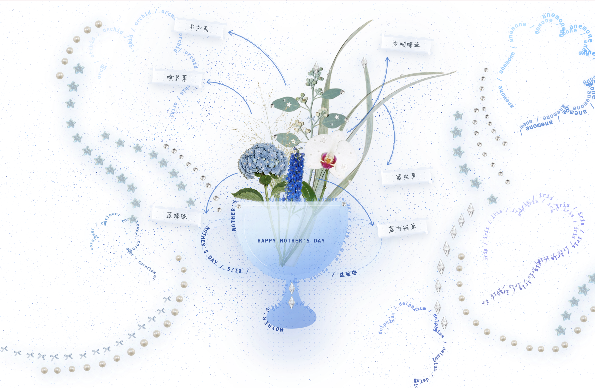
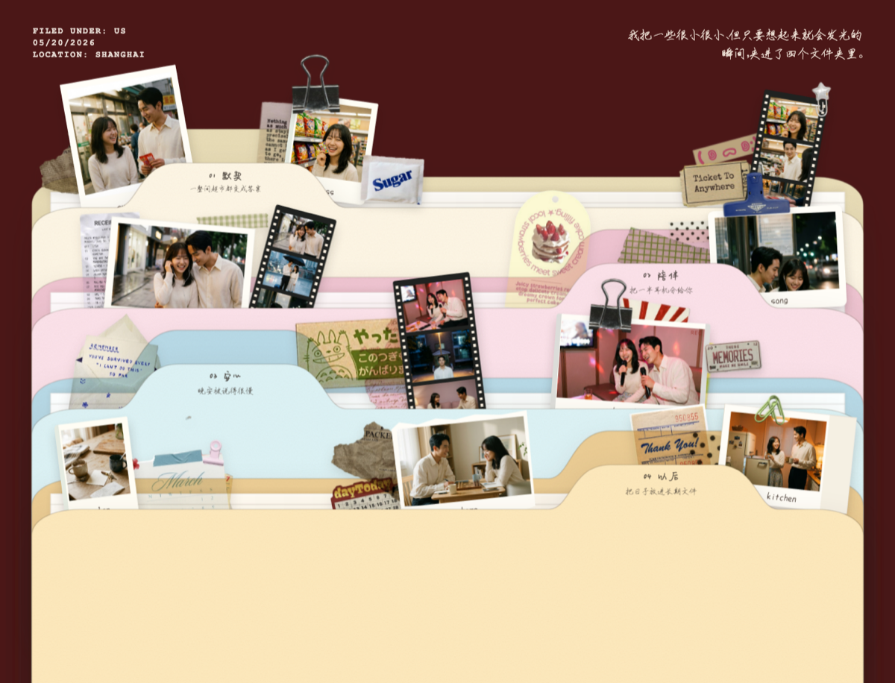
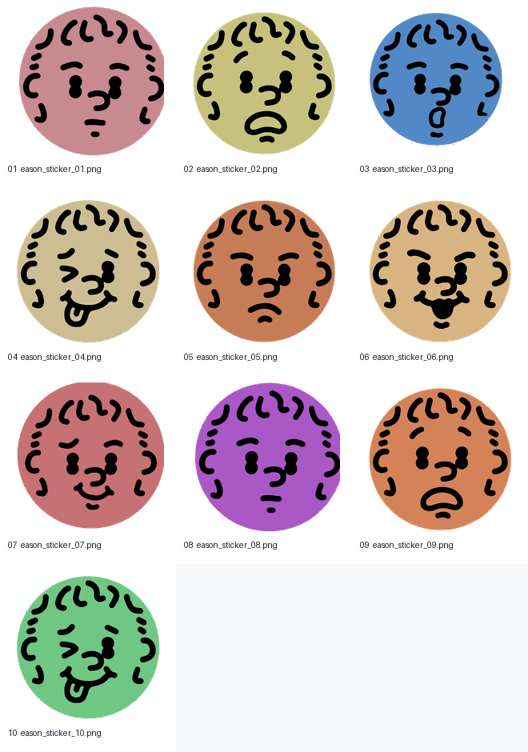

# dear

中文 · [English](#english)

## 中文

> _"亲爱的 ______，我做了一份小东西想给你。"_

**dear** 是一个给 Claude Code 用的礼物 skill。它会把每一次分享欲都变成一份有仪式感的电子礼物：一张有趣的照片、一段 TA 可能会喜欢的音乐、一句突然想起的话，都可以长成一张图、一个可以打开的小网页，或者一封只属于你们的信。

在生日、纪念日、母亲节、毕业、重逢，或者任何你想认真表达的时刻，dear 也可以作为实体礼物之外的另一层惊喜：不是替代那束花、那顿饭、那份礼物，而是把你们之间具体的记忆、玩笑、语气和心意做成一个可以被打开的体验。

```bash
/dear
```

你可以直接指定 H5、图片或文字，也可以把素材交给 dear，让它根据你们的关系和这一次想表达的情绪来提案。

[它能做什么](#它能做什么) · [快速开始](#快速开始) · [三种触发方式](#三种触发方式) · [模板模式](#模板模式直接选一个精调礼物模板) · [它怎么做礼物](#它怎么做礼物) · [安装](#安装) · [仓库结构](#仓库结构)

---

## 它能做什么

| 格式 | 举例 |
|---|---|
| **H5 互动页面** | 一个会被手指擦开的雨窗；一台只为 TA 造的复古点唱机；一个每点一下就更歪的陶艺转盘；一封要拆开三层才能看到的信 |
| **AI 生成图片** | 一张把 TA 养的多肉画成水彩的“外婆的花园”；一张写着 TA 名字的假电影票；一张 TA 的情绪气象图 |
| **文字礼物** | 一封仿照 TA 最喜欢那部电影结构写的信；一篇假装是 TA 自己写的日记；一段对 TA 最近状态的温柔观察 |

如果你已经知道想要什么形式，可以直接说；如果还没有想好，dear 会先看素材里最有生命力的部分，再决定什么形式最能把这份心意送出去。

---

## 快速开始

1. 在 Claude Code 输入 `/dear`
2. 把照片、聊天截图、朋友圈截图、文字片段或文件夹路径发进来
3. 补充你想给谁、为什么想送、希望 TA 收到时有什么感觉
4. 让 dear 把这份素材整理成一个可以交付的礼物

素材很多时，可以把它们放进一个文件夹，再把路径发给 `/dear`。

---

## 三种触发方式

每种方式对应一种“我现在突然想给 TA 做点什么”的状态。

### 1. 拖素材进聊天

先输入：

```bash
/dear
```

然后直接把照片、聊天截图、朋友圈 / 小红书 / Instagram 截图拖进 Claude Code。dear 会把这些图片当作礼物素材来读，再追问真正影响创意方向的那一两件事。

**支持的素材**：照片、截图（朋友圈/小红书/Instagram/聊天记录都行）、文字片段、文字笔记、Mac 微信导出的聊天记录（`.txt` 或 `.html`）、PDF。音频和视频只读文件名。

### 2. 扔一个文件夹

如果素材已经攒成一批文件，把它们放进桌面上的一个文件夹：

```bash
/dear ~/Desktop/for-mom/
```

dear 会先看文件列表，再读取里面能用的图片、文字、聊天记录和 PDF，从里面找可以做成礼物的细节。

### 3. 一句话起头

如果你手头没有素材，只是心里有个画面：

```bash
/dear 给我朋友小A做一份礼物 — TA最近开始学陶艺
/dear 明天是我爸60岁生日，他退休一年了
/dear 想安慰一下我室友，她猫走丢三天了
```

dear 会从这句话里读出收礼人、关系、触发瞬间和情绪方向。信息不够时，它会继续问你一两个具体问题。

### 4. 空手起头

```bash
/dear
```

当你只知道“我想给某个人做点东西”，dear 会陪你把这件事慢慢说清楚：TA 是谁、你为什么想到 TA、这份礼物想停在哪一种情绪上。

### 模板模式：直接选一个精调礼物模板

如果想从已经打磨好的模板开始，可以直接指定：

```bash
/dear --template paper-house ~/Desktop/for-mia/
/dear --template bouquet 给妈妈做一束可以拖动的花
/dear --template empty-boxes 给 TA 做一组装满零食和小票的回忆盒子
/dear --template folder 给 TA 做一组可以打开的回忆文件夹
/dear --template draw-card 给 TA 做一台可以抽小卡的复古许愿机
/dear 用 bouquet 模板给朋友做一份生日礼物
/dear 有什么模板可以用？
```

当前精调模板：

| 模板 | 适合 | 预览 | 一句话 |
|---|---|---|---|
| `paper-house` | 伴侣、周年、很亲密的朋友、长故事 | `assets/templates/paper-house/preview.jpg` | 把你们的回忆变成四个可爱的小房间，每个房间都有一首专属 BGM。 |
| `bouquet` | 生日、母亲节、感谢、朋友安慰、纪念日 | `assets/templates/bouquet/preview.jpg` | 给妈妈做一张赛博奖杯花束插画，每一朵花都藏着一个你们的故事。 |
| `empty-boxes` | 伴侣、520、生日、朋友、日常小仪式 | `assets/templates/empty-boxes/preview.jpg` | 把冰箱、购物篮、纸箱和铁盒做成一圈可以翻看的回忆收藏盒。 |
| `folder` | 伴侣、520、生日、朋友、关系章节 | `assets/templates/folder/preview.jpg` | 把你们的故事夹进四个可以打开的文件夹：照片、纸片、胶带和一句具体的话都各归其位。 |
| `draw-card` | 粉丝礼物、演唱会回忆、生日、朋友玩笑 | `assets/templates/draw-card/preview.jpg` | 做一台复古抽卡许愿机：填一句歌词和关键词，转动旋钮抽出一张可以保存的小卡。 |

### 模板 Demo：先看几个已经做好的礼物

#### paper-house

把你们一起走过的日子折进一座会发光的小房子：每个房间都有自己的音乐、自己的物件，也有一句只会在那个场景里亮起来的回忆。


#### bouquet

给妈妈做一个赛博奖杯插画：一束花像一座发光的奖杯，每一朵花都蕴藏着一个你们的故事。



#### empty-boxes

把一只只空盒子变成回忆收藏盒：冰箱里放下和好的小蛋糕，购物篮里装满零食和小票，每一层都有具体故事。


#### folder

把一段关系整理成四个可以打开的文件夹：每一层都有真实的封壳、标签页、照片、纸片和贴得住的细节。



#### draw-card

做一台霓虹复古抽卡机：歌词像雨一样落下，填好愿望卡后转动旋钮，就能吐出一张可以保存的收藏小卡。



---

## 安装

### 给安装者 / 开发者

把这个文件夹放到 Claude Code 能找到 skill 的位置：

- 全局：`~/.claude/skills/dear/`
- 或者项目内：`.claude/skills/dear/`

让脚本可执行：

```bash
chmod +x scripts/*.sh
```

然后在 Claude Code 里直接：

```bash
/dear
```

### 可选配置

核心功能不依赖任何外部服务。下面这些会增强它能做的礼物类型：

| 服务 / 环境变量 | 用来做什么 |
|---|---|
| `surge.sh` + `DEAR_HOST_DOMAIN` | 把 H5 礼物部署成一个可以直接发给 TA 的链接 |
| `OPENROUTER_API_KEY` | 图片生成（OpenRouter 路径） |
| `GEMINI_API_KEY` | 图片生成（Gemini 直连） |
| `GOOGLE_API_KEY` | 图片生成（Google AI） |
| `FREESOUND_API_KEY` | H5 背景音乐搜索 |
| `REMOVE_BG_API_KEY` | 图片抠图 |

没有这些 key 时，dear 仍然可以做文字和 H5 礼物。

H5 礼物部署示例：

```bash
DEAR_HOST_DOMAIN=my-gift.surge.sh /dear
```

或者在调用 skill 之后手动运行：

```bash
./scripts/deliver-gift.sh ./gifts/2026-05-06-mom/index.html --domain my-gift.surge.sh
```

---

## 它怎么做礼物

每一份礼物都会先经过一次内容判断，再进入具体制作：

```text
0. 素材录入      你给出的照片、截图、文字、文件夹或一句话
     ↓
1. 编辑判断      这份礼物应该轻一点、玩一点，还是认真一点？
     ↓
2. 素材综合      找到最值得被做成礼物的那个细节
     ↓
3. 创意构思      生成多个方向，选最能打动 TA 的一个
     ↓
4. 视觉策略      决定用图片、H5 或文字来承载
     ↓
5. 渲染交付      做成最终可以预览、保存或发出的礼物
```

### 先找到“为什么要送”

一份好礼物不是把素材堆上去，而是知道这一次为什么值得被做成礼物。dear 会先判断：这是庆祝、安慰、感谢、告白、玩笑，还是一次很轻的“我刚刚想到你”。

### 把素材变成表达

TA 说过的一句话、你们一起去过的地方、截图里一个很小的表情，都可能成为礼物的中心。dear 会尽量保留这些具体东西，而不是写一段谁都能收到的祝福。

### 让形式服务情绪

有些内容适合做成一张图，有些适合变成一个可以点开的网页，有些只需要一封短短的信。形式不是炫技，它只是帮那份心意找到最合适的打开方式。

---

## 仓库结构

```text
dear/
├── SKILL.md                       # skill 入口
├── references/                    # 所有子阶段的参考文档
│   ├── recipient-intake.md        # Stage 0：素材录入的三种方式
│   ├── main-flow.md               # 总流程 + 进度播报 + 模板路由
│   ├── editorial-judgment.md      # Stage 1：重量 + 叙事方向
│   ├── gifting-ethics.md          # 给“别人”做礼物的原则
│   ├── creative-concept.md        # Stage 2 + 2.5
│   ├── creative-seed-library.md
│   ├── gift-format-chooser.md     # 格式选择器
│   ├── delivery-rules.md          # 交付规则
│   ├── stage3-visual-strategy.md
│   ├── stage4-visualization.md
│   ├── pattern-cards/             # H5 pattern 卡
│   └── image-genres/              # 图片风格卡
├── assets/
│   └── templates/                 # H5 模板（p5.js）
├── scripts/
│   ├── deliver-gift.sh            # H5 本地 / 部署分发器
│   ├── deploy.sh                  # surge 部署
│   ├── render-image.sh            # 图片生成
│   ├── remove-bg.sh               # 抠图
│   ├── fetch-music.sh             # 背景音乐
│   └── fetch-asset-bundle.sh      # 按需下载参考素材
├── gift-history.example.json
├── gift-history.schema.json
└── README.md
```

---

## 运行要求

- `bash` · `python3` · `curl` · `unzip`
- 可选：`surge`（H5 在线托管）

---

---

[中文](#中文) · English

## English

> _"Dear ______, I made something for you."_

**dear** is a gift-crafting skill for Claude Code. It turns every small spark of sharing into a ceremonial digital gift: a funny photo, a song they might love, or a tiny memory that suddenly comes back can become an image, an interactive H5, or a letter made just for them.

For birthdays, anniversaries, Mother's Day, graduations, reunions, or any moment where you want to say something with care, dear can become an extra layer of surprise alongside a physical gift. It does not replace the flowers, dinner, or present; it turns the specific memories, jokes, voices, and details between you into something the recipient can open.

```bash
/dear
```

You can choose H5, image, or text yourself, or give dear the material and let it propose the format that best carries the feeling.

[What it makes](#what-it-makes) · [Quick start](#quick-start) · [Three ways to invoke](#three-ways-to-invoke) · [Template mode](#template-mode-choose-a-polished-gift-template) · [How it works](#how-it-works) · [Install](#install) · [Repo structure](#repo-structure)

---

## What It Makes

| Format | Examples |
|---|---|
| **Interactive H5** | A rain-streaked window you wipe clean to read the message; a jukebox built just for one person; a pottery wheel that gets more wobbly with each tap; a letter hidden inside three layers of wrapping |
| **AI-generated image** | A watercolor of your mom's succulent garden; a fake movie ticket with the recipient's name on it; a mood-weather map for the day |
| **Text artifact** | A letter written in the three-act rhythm of your partner's favorite movie; a diary in their voice; a short, specific observation about them |

If you know the format you want, say it. If not, dear will look for the most alive part of the material and choose the format that can carry it best.

---

## Quick start

1. Type `/dear` in Claude Code
2. Add photos, chat screenshots, social posts, text snippets, or a folder path
3. Say who the gift is for, why now, and what you hope they feel
4. Let dear turn the material into a gift you can preview, save, or send

When you have a lot of material, put it in a folder and send the path to `/dear`.

---

## Three Ways to Invoke

### 1. Drag material into chat

Start with:

```bash
/dear
```

Then drag photos, chat screenshots, WeChat / 小红书 / Instagram screenshots directly into Claude Code. dear treats them as gift material, then asks only the questions that actually affect the creative direction.

**Supported material**: photos, screenshots (WeChat, Instagram, 小红书, chat, anything), pasted text, text notes, Mac WeChat exports (`.txt` or `.html`), PDFs. Audio and video are registered by filename only.

### 2. Drop a folder

If your material is already collected in files, put them in a folder:

```bash
/dear ~/Desktop/for-mom/
```

dear reads the file list first, then pulls useful details from images, text files, chat exports, and PDFs.

### 3. Start with one sentence

If you do not have material yet, start with the feeling or occasion:

```bash
/dear make something for my friend A — they just started pottery
/dear tomorrow is my dad's 60th birthday, a year into retirement
/dear want to comfort my roommate, her cat has been missing for three days
```

dear extracts recipient, relationship, moment, and emotional intent from the brief. If something important is missing, it asks one or two concrete questions.

### 4. Start with nothing but the person

```bash
/dear
```

When all you know is “I want to make something for this person,” dear helps you find the occasion, the emotional angle, and the kind of gift that fits.

### Template mode: choose a polished gift template

If you want to start from a polished template, specify it directly:

```bash
/dear --template paper-house ~/Desktop/for-mia/
/dear --template bouquet make mom a draggable bouquet
/dear --template empty-boxes make a snack-run memory box for Ren
/dear --template folder make a layered memory folder archive for Ren
/dear --template draw-card make a retro wish-card machine for Ren
/dear use the bouquet template for a friend's birthday gift
/dear show me templates
```

Polished templates:

| Template | Best for | Preview | One-liner |
|---|---|---|---|
| `paper-house` | anniversaries, partners, very close friends, longer stories | `assets/templates/paper-house/preview.jpg` | Turns your shared memories into four charming little rooms, each with its own BGM. |
| `bouquet` | birthdays, Mother's Day, thank-you gifts, friend comfort, anniversaries | `assets/templates/bouquet/preview.jpg` | Makes mom a cyber-trophy bouquet illustration where every flower holds one of your stories. |
| `empty-boxes` | partners, 520, birthdays, close friends, everyday rituals | `assets/templates/empty-boxes/preview.jpg` | Turns refrigerators, shopping baskets, cardboard boxes, and tin cases into a loop of collectible memory boxes. |
| `folder` | partners, 520, birthdays, close friends, relationship chapters | `assets/templates/folder/preview.jpg` | Turns shared stories into four openable file folders layered with photos, papers, tapes, stickers, and one concrete line. |
| `draw-card` | fan gifts, concert memories, birthdays, close friends, playful jokes | `assets/templates/draw-card/preview.jpg` | Builds a retro wish-card gacha machine: fill a lyric and memo, turn the knob, and draw a saveable card. |

### Template demos: finished gift examples

#### paper-house

A little glowing house for the days you shared: every room has its own music, its own objects, and one memory that lights up inside that scene.


#### bouquet

Makes mom a cyber-trophy illustration: a luminous bouquet where every flower carries one story between you.


#### empty-boxes

Turns empty containers into memory boxes: a refrigerator shelf can hold a small reconciliation, a shopping basket can hold a snack run, and each collage stays grounded in concrete details.


#### folder

Turns a relationship into a tactile folder archive: real folder shells, connected tabs, layered papers, varied photo formats, and grounded chapter notes.


#### draw-card

Builds a neon retro card machine: lyric rain falls behind the scene, a wish card slides into the slot, and the knob reveals a saveable collectible card.


---

## Install

### For installers / developers

Place this folder where Claude Code looks for skills:

- Global: `~/.claude/skills/dear/`
- Or project-scoped: `.claude/skills/dear/`

Make scripts executable:

```bash
chmod +x scripts/*.sh
```

Then in Claude Code:

```bash
/dear
```

### Optional configuration

Core functionality needs no external services. These unlock richer gift types:

| Service / env var | Purpose |
|---|---|
| `surge.sh` + `DEAR_HOST_DOMAIN` | Deploy H5 gifts to a public link you can send |
| `OPENROUTER_API_KEY` | Image generation through OpenRouter |
| `GEMINI_API_KEY` | Direct Gemini image generation |
| `GOOGLE_API_KEY` | Google AI image generation |
| `FREESOUND_API_KEY` | H5 background music search |
| `REMOVE_BG_API_KEY` | Background removal for compositing |

Without those keys, dear can still make text and H5 gifts.

Deploy an H5 gift:

```bash
DEAR_HOST_DOMAIN=my-gift.surge.sh /dear ~/Desktop/for-mom/
```

Or after generation:

```bash
./scripts/deliver-gift.sh ./gifts/2026-05-06-mom/index.html --domain my-gift.surge.sh
```

---

## How It Works

Every gift starts with content judgment before production:

```text
0. Intake            The photos, screenshots, text, folder, or brief you provided
     ↓
1. Editorial         Should this feel light, playful, serious, comforting, or ceremonial?
     ↓
2. Synthesis         Find the one detail that deserves to become the center
     ↓
3. Creative concept  Generate several directions and choose the one that would land best
     ↓
4. Visual strategy   Decide whether image, H5, or text carries it best
     ↓
5. Render & deliver  Produce a gift you can preview, save, or send
```

### Find the reason for the gift

A good gift is not a pile of decoration. dear first asks what this moment is really doing: celebration, comfort, gratitude, confession, a private joke, or a soft “I just thought of you.”

### Turn material into expression

A line they said, a place you went together, a tiny expression in a screenshot — any of these can become the center. dear tries to keep those concrete details alive instead of sanding them into generic blessing copy.

### Let the form serve the feeling

Some material wants to be one image. Some wants to become a small webpage. Some only needs a short letter. The format is there to give the feeling the right way to open.

---

## Repo structure

```text
dear/
├── SKILL.md                       # Skill entry
├── references/                    # Stage-by-stage reference docs
│   ├── recipient-intake.md        # Stage 0: three intake modes
│   ├── main-flow.md               # Overall flow + progress rules + template routing
│   ├── editorial-judgment.md      # Stage 1: weight + direction
│   ├── gifting-ethics.md          # Principles for gifts-for-others
│   ├── creative-concept.md        # Stage 2 + 2.5
│   ├── creative-seed-library.md
│   ├── gift-format-chooser.md
│   ├── delivery-rules.md
│   ├── stage3-visual-strategy.md
│   ├── stage4-visualization.md
│   ├── pattern-cards/
│   └── image-genres/
├── assets/
│   └── templates/                 # H5 templates (p5.js)
├── scripts/
│   ├── deliver-gift.sh            # Local/deploy bridge
│   ├── deploy.sh                  # surge deploy
│   ├── render-image.sh
│   ├── remove-bg.sh
│   ├── fetch-music.sh
│   └── fetch-asset-bundle.sh
├── gift-history.example.json
├── gift-history.schema.json
└── README.md
```

---

## Requirements

- `bash` · `python3` · `curl` · `unzip`
- Optional: `surge` for hosted H5 previews
